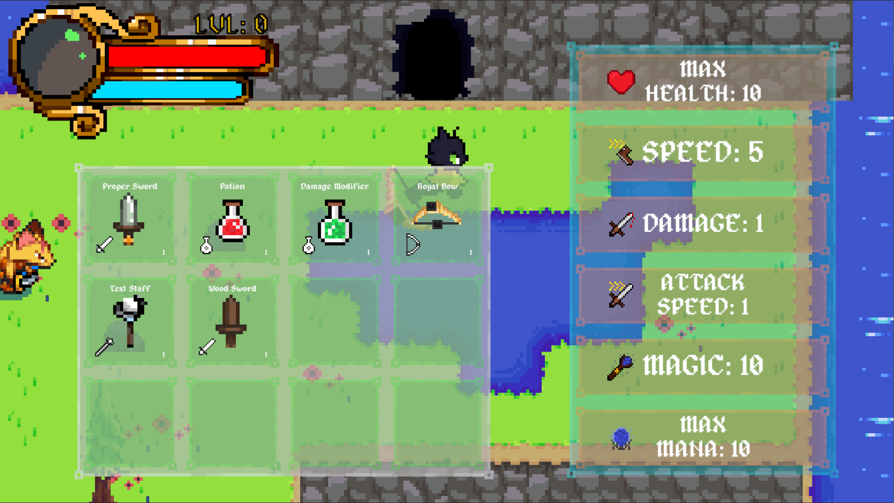
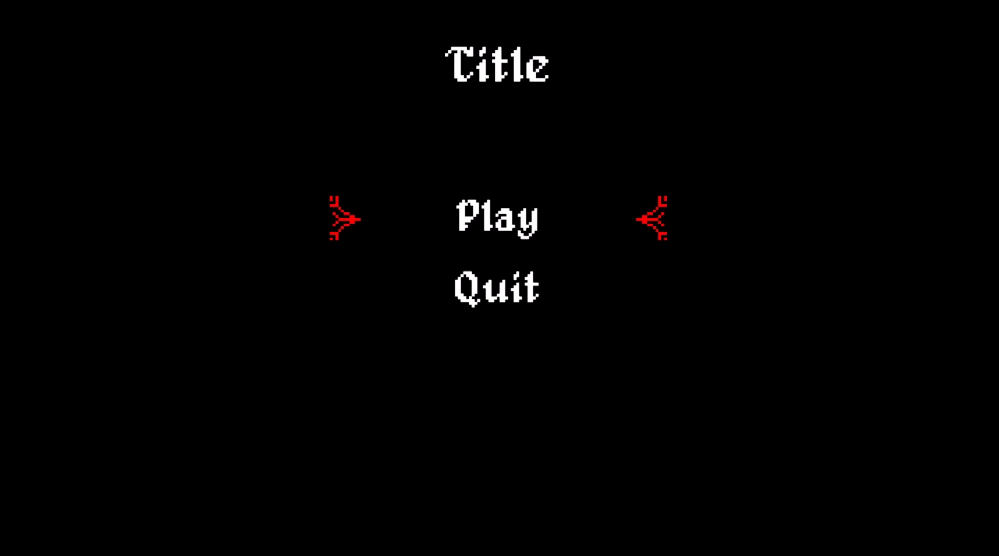

## Project
Rogue-Like game created as an introduction to the genre with many of the classic mechanics present
such as 'Invincibility Frames' during a dash, a class selection system, inventory systems and stats.
Developed as a teamwork focused module at Manchester Metropolitan University in a team of 5

## Controls
WASD to move
Left click to attack
Z, X for sword attacks
Z, X, C to use spells - will be changed in future
Tab for inventory + stats
R to swap out spells

## Screenshot
Screen shot of the UI at the end of the module

## Short Demo Video

